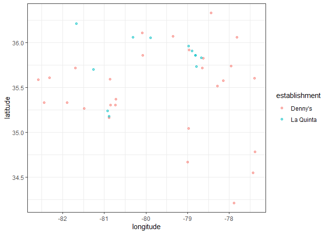

Lab 04 - La Quinta is Spanish for next to Denny’s, Pt. 1
================
Kryschelle Fakir
2/16/2024

### Load packages and data

``` r
library(tidyverse) 
library(dsbox) 
```

``` r
states <- read_csv("data/states.csv")
```

### Exercise 1 and 2

``` r
glimpse(dennys)
```

    ## Rows: 1,643
    ## Columns: 6
    ## $ address   <chr> "2900 Denali", "3850 Debarr Road", "1929 Airport Way", "230 …
    ## $ city      <chr> "Anchorage", "Anchorage", "Fairbanks", "Auburn", "Birmingham…
    ## $ state     <chr> "AK", "AK", "AK", "AL", "AL", "AL", "AL", "AL", "AL", "AL", …
    ## $ zip       <chr> "99503", "99508", "99701", "36849", "35207", "35294", "35056…
    ## $ longitude <dbl> -149.8767, -149.8090, -147.7600, -85.4681, -86.8317, -86.803…
    ## $ latitude  <dbl> 61.1953, 61.2097, 64.8366, 32.6033, 33.5615, 33.5007, 34.206…

``` r
view(dennys)
glimpse(laquinta)
```

    ## Rows: 909
    ## Columns: 6
    ## $ address   <chr> "793 W. Bel Air Avenue", "3018 CatClaw Dr", "3501 West Lake …
    ## $ city      <chr> "\nAberdeen", "\nAbilene", "\nAbilene", "\nAcworth", "\nAda"…
    ## $ state     <chr> "MD", "TX", "TX", "GA", "OK", "TX", "AG", "TX", "NM", "NM", …
    ## $ zip       <chr> "21001", "79606", "79601", "30102", "74820", "75254", "20345…
    ## $ longitude <dbl> -76.18846, -99.77877, -99.72269, -84.65609, -96.63652, -96.8…
    ## $ latitude  <dbl> 39.52322, 32.41349, 32.49136, 34.08204, 34.78180, 32.95164, …

``` r
view(laquinta)
```

For Dennys, the dataset has 6 columns and 1643 rows. Each row is a
specific Dennys’ location and the variables are address, city, state,
zip code, longitude, and latitude. For LaQuinta, the dataset has 6
columns and 909 rows. Each row is a specific LaQuinta location and the
variables are address, city, state, sip code, longtiude, and latitude.

### Exercise 3

There are a decent number of LaQuinta locations outside of the U.S.
There are 7 LaQuinta’s in China, 3 in New Zealand, 1 in Georgia, 5 in
Turkey, 2 in the United Arab Emirates, 1 in Colombia, and 1 in Ecuador.
As for Denny’s, just by going based off of the website, there does not
appear to be any locations outside of the US. However, there are 1257 US
locations listed on the website but 1643 rows. This discrepancy makes me
think that there are locations outside of the US that aren’t explicity
mentioned on the website. That or there’s been lots of closings since
the initial making of this dataset.

### Exercise 4

To determine whether a location is outside of the US, perhaps we could
filter out cases that have N/A for state.

### Exercise 5

``` r
dennys %>%
  filter(!(state %in% states$abbreviation))
```

    ## # A tibble: 0 × 6
    ## # ℹ 6 variables: address <chr>, city <chr>, state <chr>, zip <chr>,
    ## #   longitude <dbl>, latitude <dbl>

There are no Denny locations outside of the US.

### Exercise 6

``` r
dennys <- dennys %>%
  mutate(country = "United States")
```

### Exercise 7

``` r
laquinta %>%
  filter(!(state %in% states$abbreviation))
```

    ## # A tibble: 14 × 6
    ##    address                                  city  state zip   longitude latitude
    ##    <chr>                                    <chr> <chr> <chr>     <dbl>    <dbl>
    ##  1 Carretera Panamericana Sur KM 12         "\nA… AG    20345    -102.     21.8 
    ##  2 Av. Tulum Mza. 14 S.M. 4 Lote 2          "\nC… QR    77500     -86.8    21.2 
    ##  3 Ejercito Nacional 8211                   "Col… CH    32528    -106.     31.7 
    ##  4 Blvd. Aeropuerto 4001                    "Par… NL    66600    -100.     25.8 
    ##  5 Carrera 38 # 26-13 Avenida las Palmas c… "\nM… ANT   0500…     -75.6     6.22
    ##  6 AV. PINO SUAREZ No. 1001                 "Col… NL    64000    -100.     25.7 
    ##  7 Av. Fidel Velazquez #3000 Col. Central   "\nM… NL    64190    -100.     25.7 
    ##  8 63 King Street East                      "\nO… ON    L1H1…     -78.9    43.9 
    ##  9 Calle Las Torres-1 Colonia Reforma       "\nP… VE    93210     -97.4    20.6 
    ## 10 Blvd. Audi N. 3 Ciudad Modelo            "\nS… PU    75010     -97.8    19.2 
    ## 11 Ave. Zeta del Cochero No 407             "Col… PU    72810     -98.2    19.0 
    ## 12 Av. Benito Juarez 1230 B (Carretera 57)… "\nS… SL    78399    -101.     22.1 
    ## 13 Blvd. Fuerza Armadas                     "con… FM    11101     -87.2    14.1 
    ## 14 8640 Alexandra Rd                        "\nR… BC    V6X1…    -123.     49.2

### Exercise 8

``` r
laquinta <- laquinta %>%
  mutate(country = case_when(
    state %in% state.abb ~ "United States",
    state %in% c("ON", "BC") ~ "Canada",
    state == "ANT" ~ "Colombia",
    state == "AG" ~ "Mexico", 
    state == "QR" ~ "Mexico", 
    state == "CH" ~ "Mexico", 
    state == "NL" ~ "Mexico",
    state == "VE" ~ "Mexico", 
    state == "PU" ~ "Mexico", 
    state == "SL" ~ "Mexico",
    state == "FM" ~ "Honduras"
  ))
```

### Exercise 9

``` r
laquinta <- laquinta %>%
  filter(country == "United States")

laquinta %>%
  count(state) %>%
  arrange(n)
```

    ## # A tibble: 48 × 2
    ##    state     n
    ##    <chr> <int>
    ##  1 ME        1
    ##  2 AK        2
    ##  3 NH        2
    ##  4 RI        2
    ##  5 SD        2
    ##  6 VT        2
    ##  7 WV        3
    ##  8 WY        3
    ##  9 IA        4
    ## 10 MI        4
    ## # ℹ 38 more rows

``` r
dennys %>% 
  count(state) %>%
  arrange(n)
```

    ## # A tibble: 51 × 2
    ##    state     n
    ##    <chr> <int>
    ##  1 DE        1
    ##  2 DC        2
    ##  3 VT        2
    ##  4 AK        3
    ##  5 IA        3
    ##  6 NH        3
    ##  7 SD        3
    ##  8 WV        3
    ##  9 LA        4
    ## 10 MT        4
    ## # ℹ 41 more rows

The state with the most LaQuinta locations is Texas and the state with
the least LaQuinta locations is Maine. This makes sense to me honestly;
Maine is way up north and I’ve always conceptualized the La Quinta as a
distinctly southern/southwestern business.

The state with the most Dennys’ locations is California and the state
with the least Dennys’ locations is Delaware. These numbers make some
sense! Delaware is a smaller state, whereas California is huge, with
lots of potential for more locations. I thought that Florida would be
the state with the most locations though because I feel like their food
and business would appeal to Floridians and others living in the deep
south.

### Exercise 10

``` r
dennys %>%
  count(state) %>%
  inner_join(states, by = c("state" = "abbreviation")) %>%
  arrange(n)
```

    ## # A tibble: 51 × 4
    ##    state     n name                     area
    ##    <chr> <int> <chr>                   <dbl>
    ##  1 DE        1 Delaware               2489. 
    ##  2 DC        2 District of Columbia     68.3
    ##  3 VT        2 Vermont                9616. 
    ##  4 AK        3 Alaska               665384. 
    ##  5 IA        3 Iowa                  56273. 
    ##  6 NH        3 New Hampshire          9349. 
    ##  7 SD        3 South Dakota          77116. 
    ##  8 WV        3 West Virginia         24230. 
    ##  9 LA        4 Louisiana             52378. 
    ## 10 MT        4 Montana              147040. 
    ## # ℹ 41 more rows

``` r
laquinta %>%
  count(state) %>%
  inner_join(states, by = c("state" = "abbreviation")) %>%
  arrange(n)
```

    ## # A tibble: 48 × 4
    ##    state     n name             area
    ##    <chr> <int> <chr>           <dbl>
    ##  1 ME        1 Maine          35380.
    ##  2 AK        2 Alaska        665384.
    ##  3 NH        2 New Hampshire   9349.
    ##  4 RI        2 Rhode Island    1545.
    ##  5 SD        2 South Dakota   77116.
    ##  6 VT        2 Vermont         9616.
    ##  7 WV        3 West Virginia  24230.
    ##  8 WY        3 Wyoming        97813.
    ##  9 IA        4 Iowa           56273.
    ## 10 MI        4 Michigan       96714.
    ## # ℹ 38 more rows

California, Texas, and Florida have the most Dennys’ locations per
thousand square miles.

Texas, Florida, and California have the most La Quinta’s per though
square miles.

``` r
dennys <- dennys %>%
  mutate(establishment = "Denny's")
laquinta <- laquinta %>%
  mutate(establishment = "La Quinta")

dn_lq <- bind_rows(dennys, laquinta)

ggplot(dn_lq, mapping = aes(
  x = longitude, 
  y = latitude, 
  color = establishment
)) + 
  geom_point()
```

<!-- -->

### Exercise 11

``` r
nc_dn <- dennys %>%
  filter(state == "NC")

nc_lq <- laquinta %>% 
  filter(state == "NC")

nc_dn_lq <- bind_rows(nc_dn, nc_lq)

nc_plot <- ggplot(nc_dn_lq, mapping = aes(
  x = longitude, 
  y = latitude, 
  color = establishment
)) + 
  geom_point(alpha = 0.5)

nc_plot + theme_bw()
```

<!-- -->

Visually, there are quite a few La Quinta’s near Denny’s but they’re not
exclusively next to each other. Similarly, there are plenty of Denny’s
that stand alone from La Quinta’s. So I wouldn’t tell people that there
will always be a La Quinta near a Denny’s. But maybe in a more populated
area, you are likely to see them close by.

### Exercise 12

``` r
tx_dn <- dennys %>%
  filter(state == "TX")

tx_lq <- laquinta %>% 
  filter(state == "TX")

tx_dn_lq <- bind_rows(tx_dn, tx_lq)

tx_plot <- ggplot(tx_dn_lq, mapping = aes(
  x = longitude, 
  y = latitude, 
  color = establishment
)) + 
  geom_point(alpha = 0.1)

tx_plot + theme_bw()
```

<!-- -->

Visually, yes, Hedberg’s joke does appear to hold. Every La Quinta has a
Denny’s nearby.
